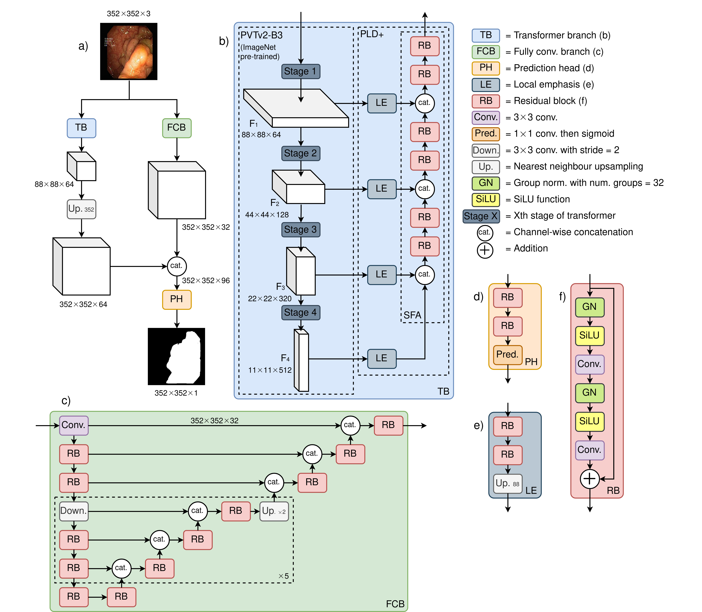
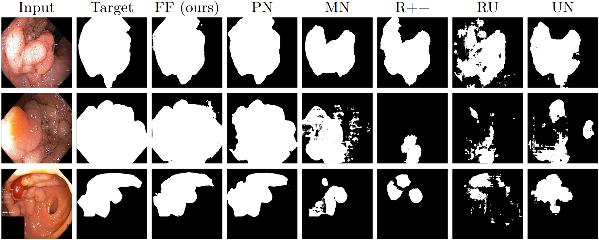
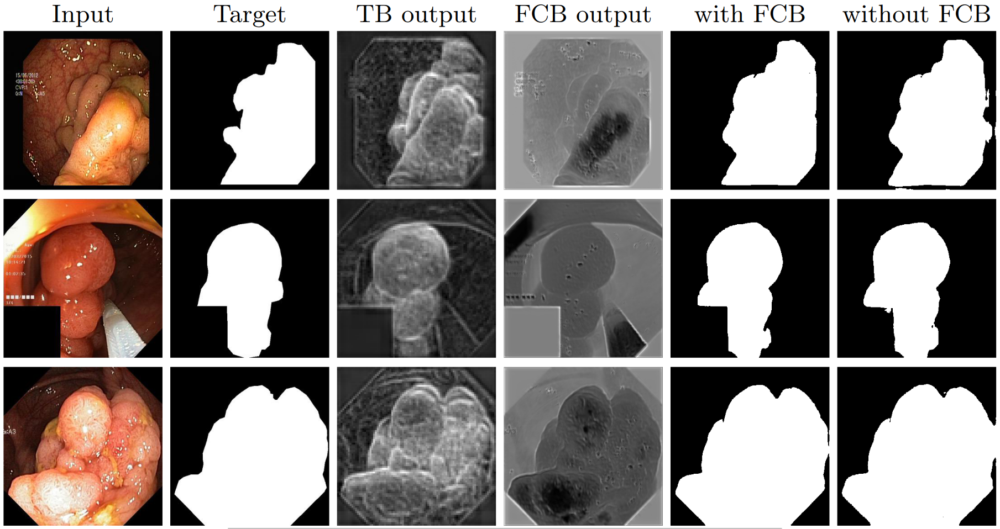

[](https://paperswithcode.com/sota/medical-image-segmentation-on-kvasir-seg?p=fcn-transformer-feature-fusion-for-polyp)
	
[](https://paperswithcode.com/sota/medical-image-segmentation-on-cvc-clinicdb?p=fcn-transformer-feature-fusion-for-polyp)

# FCBFormer

Official code repository for: FCN-Transformer Feature Fusion for Polyp Segmentation (MIUA 2022 paper)

Authors: [Edward Sanderson](https://scholar.google.com/citations?user=ea4c7r0AAAAJ&hl=en&oi=ao) and [Bogdan J. Matuszewski](https://scholar.google.co.uk/citations?user=QlUO_oAAAAAJ&hl=en)

Links to the paper:
+ [Springer (Open Access)](https://link.springer.com/chapter/10.1007/978-3-031-12053-4_65)
+ [arXiv](https://arxiv.org/abs/2208.08352)

## 1. Overview

### 1.1 Abstract

Colonoscopy is widely recognised as the gold standard procedure for the early detection of colorectal cancer (CRC). Segmentation is valuable for two significant clinical applications, namely lesion detection and classification, providing means to improve accuracy and robustness. The manual segmentation of polyps in colonoscopy images is timeconsuming. As a result, the use of deep learning (DL) for automation of polyp segmentation has become important. However, DL-based solutions can be vulnerable to overfitting and the resulting inability to generalise to images captured by different colonoscopes. Recent transformer-based architectures for semantic segmentation both achieve higher performance and generalise better than alternatives, however typically predict a segmentation map of $\frac{h}{4} × \frac{w}{4}$ spatial dimensions for a $h \times w$ input image. To
this end, we propose a new architecture for full-size segmentation which leverages the strengths of a transformer in extracting the most important features for segmentation in a primary branch, while compensating for its limitations in full-size prediction with a secondary fully convolutional branch. The resulting features from both branches are then fused for final prediction of a $h × w$ segmentation map. We demonstrate our method’s state-of-the-art performance with respect to the mDice, mIoU, mPrecision, and mRecall metrics, on both the Kvasir-SEG and CVC-ClinicDB dataset benchmarks. Additionally, we train the model on each of these datasets and evaluate on the other to demonstrate its superior generalisation performance.

### 1.2 Architecture

<p align="center">
	 <br />
	<em>
		Figure 1: Illustration of the proposed FCBFormer architecture
	</em>
</p>

### 1.3 Qualitative results

<p align="center">
	 <br />
	<em>
		Figure 2: Comparison of predictions of FCBFormer against baselines. FF is FCBFormer, PN is PraNet, MN is MSRF-Net, R++ is ResUNet++, UN is U-Net
	</em>
</p>

<p align="center">
	 <br />
	<em>
		Figure 3: Visualisation of the benefit of the fully convolutional branch (FCB)
	</em>
</p>

## 2. Usage

### 2.1 Preparation

+ Create and activate virtual environment:

```
python3 -m venv ~/FCBFormer-env
source ~/FCBFormer-env/bin/activate
```

+ Clone the repository and navigate to new directory:

```
git clone https://github.com/ESandML/FCBFormer
cd ./FCBFormer
```

+ Install the requirements:

```
pip install -r requirements.txt
```

+ Download and extract the [Kvasir-SEG](https://datasets.simula.no/downloads/kvasir-seg.zip) and the [CVC-ClinicDB](https://www.dropbox.com/s/p5qe9eotetjnbmq/CVC-ClinicDB.rar?dl=0) datasets.

+ Download the [PVTv2-B3](https://github.com/whai362/PVT/releases/download/v2/pvt_v2_b3.pth) weights to `./`

### 2.2 Training

Train FCBFormer on the train split of a dataset:

```
python train.py --dataset=[train data] --data-root=[path]
```

+ Replace `[train data]` with training dataset name (options: `Kvasir`; `CVC`).

+ Replace `[path]` with path to parent directory of `/images` and `/masks` directories (training on Kvasir-SEG); or parent directory of `/Original` and `/Ground Truth` directories (training on CVC-ClinicDB).

+ To train on multiple GPUs, include `--multi-gpu=true`.

### 2.3 Prediction

Generate predictions from a trained model for a test split. Note, the test split can be from a different dataset to the train split:

```
python predict.py --train-dataset=[train data] --test-dataset=[test data] --data-root=[path]
```

+ Replace `[train data]` with training dataset name (options: `Kvasir`; `CVC`).

+ Replace `[test data]` with testing dataset name (options: `Kvasir`; `CVC`).

+ Replace `[path]` with path to parent directory of `/images` and `/masks` directories (testing on Kvasir-SEG); or parent directory of `/Original` and `/Ground Truth` directories (testing on CVC-ClinicDB).

### 2.4 Evaluation

Evaluate pre-computed predictions from a trained model for a test split. Note, the test split can be from a different dataset to the train split:

```
python eval.py --train-dataset=[train data] --test-dataset=[test data] --data-root=[path]
```

+ Replace `[train data]` with training dataset name (options: `Kvasir`; `CVC`).

+ Replace `[test data]` with testing dataset name (options: `Kvasir`; `CVC`).

+ Replace `[path]` with path to parent directory of `/images` and `/masks` directories (testing on Kvasir-SEG); or parent directory of `/Original` and `/Ground Truth` directories (testing on CVC-ClinicDB).

## 3. License

This repository is released under the Apache 2.0 license as found in the [LICENSE](https://github.com/ESandML/FCBFormer/blob/main/LICENSE) file.

## 4. Citation

If you use this work, please consider citing us:

```bibtex
@inproceedings{sanderson2022fcn,
  title={FCN-Transformer Feature Fusion for Polyp Segmentation},
  author={Sanderson, Edward and Matuszewski, Bogdan J},
  booktitle={Annual Conference on Medical Image Understanding and Analysis},
  pages={892--907},
  year={2022},
  organization={Springer}
}
```

## 5. Commercial use

We allow commerical use of this work, as permitted by the [LICENSE](https://github.com/ESandML/FCBFormer/blob/main/LICENSE). However, where possible, please inform us of this use for the facilitation of our impact case studies.

## 6. Acknowledgements

This work was supported by the Science and Technology Facilities Council [grant number ST/S005404/1].

This work was in part performed using a DiRAC Director’s Discretionary award. The work was carried out on the Cambridge Service for Data Driven Discovery (CSD3), part of which is operated by the University of Cambridge Research Computing on behalf of the STFC DiRAC HPC Facility (www.dirac.ac.uk). The DiRAC component of CSD3 was funded by BEIS capital funding via STFC capital grants ST/P002307/1 and ST/R002452/1 and STFC operations grant ST/R00689X/1. DiRAC is part of the National e-Infrastructure.

This work makes use of data from the Kvasir-SEG dataset, available at https://datasets.simula.no/kvasir-seg/.

This work makes use of data from the CVC-ClinicDB dataset, available at https://polyp.grand-challenge.org/CVCClinicDB/.

This repository includes code (`./Models/pvt_v2.py`) ported from the [PVT/PVTv2](https://github.com/whai362/PVT) repository.

## 7. Additional information

Links: [AIdDeCo Project](https://www.uclan.ac.uk/research/activity/machine-learning-cancer-detection), [CVML Group](https://www.uclan.ac.uk/research/activity/cvml)

Contact: esanderson4@uclan.ac.uk
